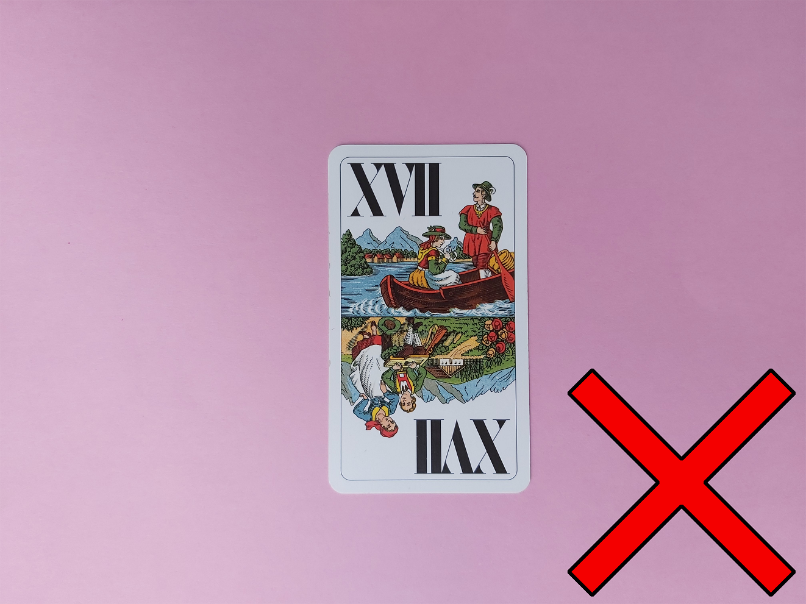

# Tarock-Cards-Synthetic-Data-Generator-for-Object-Detection-yolov3
The code and all details about the progress of the generation of synthetic data of tarock cards can be found in the Python Notebook. My original images are located in the folder 'images_original'.
| | | | | | |
:-------------------------:|:-------------------------:|:-------------------------:|:-------------------------:|:-------------------------:|:-------------------------:
  |   |   |    |    |  

